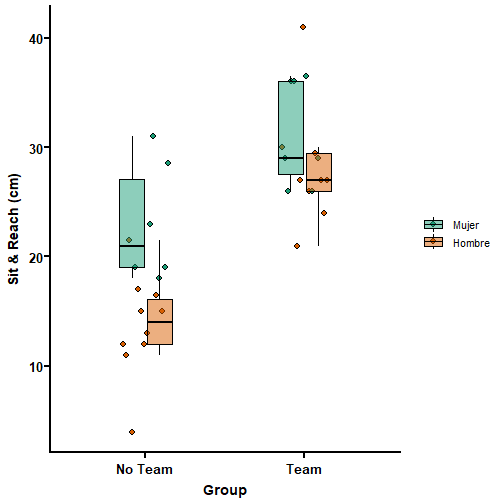

---
title: "Analisis de Flexibilidad en Atletas Chilenos"
author: "Samuel Montalvo, Ph.D."
date: "10/20/2022"
output:
  html_document: default
  word_document: default
  pdf_document: default
---
primero importamos la data


```r
library(readxl)
Data <- read_excel("Data.xlsx")
View(Data)
```

Lista de paquetes para analisar la data


```r
library(dplyr)
library(table1)
library(ggplot2)
library(ggprism)
library(rstatix)
library(kableExtra)
```

Veremos primero los nombres de la data


```r
names(Data)
```

```
##  [1] "ID"          "Club"        "Sexo"        "Edad"        "Años"       
##  [6] "Día/semana"  "Peso"        "Talla"       "IMC"         "Sit_&_Reach"
## [11] "Grupo"
```

Hombres y mujeres no estan escritos completos por lo tanto tendremos que darle un nombre completo


```r
Data$Sexo  <- recode_factor(Data$Sexo , 'M'= "Mujer", 'H' = "Hombre")
```

Tambien hubo un caso donde un participante esta como "NTeam" y los demas estan como "No Team", se asume que que ambos son No_Team


```r
Data$Grupo  <- recode_factor(Data$Grupo, 'NTeam'= "No Team", "No Team"="No Team",
                             'Team'='Team')
```

La data se tiene que convertir de caracteres a numericos y cambiar los "," por ".", tambien cambiamos los labels para usar la data mas rapido


```r
Data$Peso <- as.numeric(gsub(",",".",Data$Peso))
label(Data$Peso) <- "Peso (kg)"
Data$Talla <- as.numeric(gsub(",",".",Data$Talla))
label(Data$Talla) <- "Talla (m)"
Data$IMC <- as.numeric(gsub(",",".",Data$IMC))
label(Data$IMC) <- "Indice de masa corporal (kg/m2)"
Data$Años <- as.numeric(gsub(",",".",Data$Años))
label(Data$Años) <- "Edad (años)"
Data$`Sit_&_Reach` <- as.numeric(gsub(",",".",Data$`Sit_&_Reach`))
Data <- rename(Data, Sit_Reach ="Sit_&_Reach" )
label(Data$Sit_Reach) <- "Sit & Reach (cm)"
```

Ahora creamos una table con la data descriptiva


```r
table <- table1(~ Edad + Peso +Talla + IMC +
         Años + Sit_Reach | Sexo*Grupo, data=Data, overall=FALSE)
t1flex(table)
```

```{=html}
<div class="tabwid"><style>.cl-e8a2cf40{}.cl-e89832b0{font-family:'Arial';font-size:11pt;font-weight:normal;font-style:normal;text-decoration:none;color:rgba(0, 0, 0, 1.00);background-color:transparent;}.cl-e89832b1{font-family:'Arial';font-size:11pt;font-weight:bold;font-style:normal;text-decoration:none;color:rgba(0, 0, 0, 1.00);background-color:transparent;}.cl-e89cb16e{margin:0;text-align:center;border-bottom: 0 solid rgba(0, 0, 0, 1.00);border-top: 0 solid rgba(0, 0, 0, 1.00);border-left: 0 solid rgba(0, 0, 0, 1.00);border-right: 0 solid rgba(0, 0, 0, 1.00);padding-bottom:5pt;padding-top:5pt;padding-left:5pt;padding-right:5pt;line-height: 1;background-color:transparent;}.cl-e89cb16f{margin:0;text-align:left;border-bottom: 0 solid rgba(0, 0, 0, 1.00);border-top: 0 solid rgba(0, 0, 0, 1.00);border-left: 0 solid rgba(0, 0, 0, 1.00);border-right: 0 solid rgba(0, 0, 0, 1.00);padding-bottom:5pt;padding-top:5pt;padding-left:5pt;padding-right:5pt;line-height: 1;background-color:transparent;}.cl-e89ce094{width:2.476in;background-color:transparent;vertical-align: middle;border-bottom: 2pt solid rgba(102, 102, 102, 1.00);border-top: 2pt solid rgba(102, 102, 102, 1.00);border-left: 0 solid rgba(0, 0, 0, 1.00);border-right: 0 solid rgba(0, 0, 0, 1.00);margin-bottom:0;margin-top:0;margin-left:0;margin-right:0;}.cl-e89ce095{width:1.559in;background-color:transparent;vertical-align: middle;border-bottom: 2pt solid rgba(102, 102, 102, 1.00);border-top: 2pt solid rgba(102, 102, 102, 1.00);border-left: 0 solid rgba(0, 0, 0, 1.00);border-right: 0 solid rgba(0, 0, 0, 1.00);margin-bottom:0;margin-top:0;margin-left:0;margin-right:0;}.cl-e89ce096{width:1.389in;background-color:transparent;vertical-align: middle;border-bottom: 2pt solid rgba(102, 102, 102, 1.00);border-top: 2pt solid rgba(102, 102, 102, 1.00);border-left: 0 solid rgba(0, 0, 0, 1.00);border-right: 0 solid rgba(0, 0, 0, 1.00);margin-bottom:0;margin-top:0;margin-left:0;margin-right:0;}.cl-e89ce097{width:1.474in;background-color:transparent;vertical-align: middle;border-bottom: 2pt solid rgba(102, 102, 102, 1.00);border-top: 2pt solid rgba(102, 102, 102, 1.00);border-left: 0 solid rgba(0, 0, 0, 1.00);border-right: 0 solid rgba(0, 0, 0, 1.00);margin-bottom:0;margin-top:0;margin-left:0;margin-right:0;}.cl-e89ce098{width:2.476in;background-color:transparent;vertical-align: middle;border-bottom: 2pt solid rgba(102, 102, 102, 1.00);border-top: 2pt solid rgba(102, 102, 102, 1.00);border-left: 0 solid rgba(0, 0, 0, 1.00);border-right: 0 solid rgba(0, 0, 0, 1.00);margin-bottom:0;margin-top:0;margin-left:0;margin-right:0;}.cl-e89ce099{width:2.476in;background-color:transparent;vertical-align: middle;border-bottom: 0 solid rgba(0, 0, 0, 1.00);border-top: 0 solid rgba(0, 0, 0, 1.00);border-left: 0 solid rgba(0, 0, 0, 1.00);border-right: 0 solid rgba(0, 0, 0, 1.00);margin-bottom:0;margin-top:0;margin-left:0;margin-right:0;}.cl-e89ce09a{width:1.559in;background-color:transparent;vertical-align: middle;border-bottom: 0 solid rgba(0, 0, 0, 1.00);border-top: 0 solid rgba(0, 0, 0, 1.00);border-left: 0 solid rgba(0, 0, 0, 1.00);border-right: 0 solid rgba(0, 0, 0, 1.00);margin-bottom:0;margin-top:0;margin-left:0;margin-right:0;}.cl-e89ce09b{width:1.389in;background-color:transparent;vertical-align: middle;border-bottom: 0 solid rgba(0, 0, 0, 1.00);border-top: 0 solid rgba(0, 0, 0, 1.00);border-left: 0 solid rgba(0, 0, 0, 1.00);border-right: 0 solid rgba(0, 0, 0, 1.00);margin-bottom:0;margin-top:0;margin-left:0;margin-right:0;}.cl-e89ce09c{width:1.474in;background-color:transparent;vertical-align: middle;border-bottom: 0 solid rgba(0, 0, 0, 1.00);border-top: 0 solid rgba(0, 0, 0, 1.00);border-left: 0 solid rgba(0, 0, 0, 1.00);border-right: 0 solid rgba(0, 0, 0, 1.00);margin-bottom:0;margin-top:0;margin-left:0;margin-right:0;}.cl-e89ce09d{width:2.476in;background-color:transparent;vertical-align: middle;border-bottom: 0 solid rgba(0, 0, 0, 1.00);border-top: 0 solid rgba(0, 0, 0, 1.00);border-left: 0 solid rgba(0, 0, 0, 1.00);border-right: 0 solid rgba(0, 0, 0, 1.00);margin-bottom:0;margin-top:0;margin-left:0;margin-right:0;}.cl-e89ce09e{width:1.559in;background-color:transparent;vertical-align: middle;border-bottom: 0 solid rgba(0, 0, 0, 1.00);border-top: 0 solid rgba(0, 0, 0, 1.00);border-left: 0 solid rgba(0, 0, 0, 1.00);border-right: 0 solid rgba(0, 0, 0, 1.00);margin-bottom:0;margin-top:0;margin-left:0;margin-right:0;}.cl-e89d0722{width:1.389in;background-color:transparent;vertical-align: middle;border-bottom: 0 solid rgba(0, 0, 0, 1.00);border-top: 0 solid rgba(0, 0, 0, 1.00);border-left: 0 solid rgba(0, 0, 0, 1.00);border-right: 0 solid rgba(0, 0, 0, 1.00);margin-bottom:0;margin-top:0;margin-left:0;margin-right:0;}.cl-e89d0723{width:1.474in;background-color:transparent;vertical-align: middle;border-bottom: 0 solid rgba(0, 0, 0, 1.00);border-top: 0 solid rgba(0, 0, 0, 1.00);border-left: 0 solid rgba(0, 0, 0, 1.00);border-right: 0 solid rgba(0, 0, 0, 1.00);margin-bottom:0;margin-top:0;margin-left:0;margin-right:0;}.cl-e89d0724{width:2.476in;background-color:transparent;vertical-align: middle;border-bottom: 0 solid rgba(0, 0, 0, 1.00);border-top: 0 solid rgba(0, 0, 0, 1.00);border-left: 0 solid rgba(0, 0, 0, 1.00);border-right: 0 solid rgba(0, 0, 0, 1.00);margin-bottom:0;margin-top:0;margin-left:0;margin-right:0;}.cl-e89d0725{width:1.559in;background-color:transparent;vertical-align: middle;border-bottom: 0 solid rgba(0, 0, 0, 1.00);border-top: 0 solid rgba(0, 0, 0, 1.00);border-left: 0 solid rgba(0, 0, 0, 1.00);border-right: 0 solid rgba(0, 0, 0, 1.00);margin-bottom:0;margin-top:0;margin-left:0;margin-right:0;}.cl-e89d0726{width:1.389in;background-color:transparent;vertical-align: middle;border-bottom: 0 solid rgba(0, 0, 0, 1.00);border-top: 0 solid rgba(0, 0, 0, 1.00);border-left: 0 solid rgba(0, 0, 0, 1.00);border-right: 0 solid rgba(0, 0, 0, 1.00);margin-bottom:0;margin-top:0;margin-left:0;margin-right:0;}.cl-e89d0727{width:1.474in;background-color:transparent;vertical-align: middle;border-bottom: 0 solid rgba(0, 0, 0, 1.00);border-top: 0 solid rgba(0, 0, 0, 1.00);border-left: 0 solid rgba(0, 0, 0, 1.00);border-right: 0 solid rgba(0, 0, 0, 1.00);margin-bottom:0;margin-top:0;margin-left:0;margin-right:0;}.cl-e89d0728{width:2.476in;background-color:transparent;vertical-align: middle;border-bottom: 2pt solid rgba(102, 102, 102, 1.00);border-top: 0 solid rgba(0, 0, 0, 1.00);border-left: 0 solid rgba(0, 0, 0, 1.00);border-right: 0 solid rgba(0, 0, 0, 1.00);margin-bottom:0;margin-top:0;margin-left:0;margin-right:0;}.cl-e89d0729{width:1.559in;background-color:transparent;vertical-align: middle;border-bottom: 2pt solid rgba(102, 102, 102, 1.00);border-top: 0 solid rgba(0, 0, 0, 1.00);border-left: 0 solid rgba(0, 0, 0, 1.00);border-right: 0 solid rgba(0, 0, 0, 1.00);margin-bottom:0;margin-top:0;margin-left:0;margin-right:0;}.cl-e89d072a{width:1.389in;background-color:transparent;vertical-align: middle;border-bottom: 2pt solid rgba(102, 102, 102, 1.00);border-top: 0 solid rgba(0, 0, 0, 1.00);border-left: 0 solid rgba(0, 0, 0, 1.00);border-right: 0 solid rgba(0, 0, 0, 1.00);margin-bottom:0;margin-top:0;margin-left:0;margin-right:0;}.cl-e89d072b{width:1.474in;background-color:transparent;vertical-align: middle;border-bottom: 2pt solid rgba(102, 102, 102, 1.00);border-top: 0 solid rgba(0, 0, 0, 1.00);border-left: 0 solid rgba(0, 0, 0, 1.00);border-right: 0 solid rgba(0, 0, 0, 1.00);margin-bottom:0;margin-top:0;margin-left:0;margin-right:0;}</style><table class='cl-e8a2cf40'><thead><tr style="overflow-wrap:break-word;"><td class="cl-e89ce094"><p class="cl-e89cb16e"><span class="cl-e89832b0"></span></p></td><td  colspan="2"class="cl-e89ce095"><p class="cl-e89cb16e"><span class="cl-e89832b0">Mujer</span></p></td><td  colspan="2"class="cl-e89ce097"><p class="cl-e89cb16e"><span class="cl-e89832b0">Hombre</span></p></td></tr><tr style="overflow-wrap:break-word;"><td class="cl-e89ce098"><p class="cl-e89cb16f"><span class="cl-e89832b0"> </span></p></td><td class="cl-e89ce095"><p class="cl-e89cb16e"><span class="cl-e89832b0">No Team</span><br><span class="cl-e89832b0">(N=6)</span></p></td><td class="cl-e89ce096"><p class="cl-e89cb16e"><span class="cl-e89832b0">Team</span><br><span class="cl-e89832b0">(N=7)</span></p></td><td class="cl-e89ce097"><p class="cl-e89cb16e"><span class="cl-e89832b0">No Team</span><br><span class="cl-e89832b0">(N=10)</span></p></td><td class="cl-e89ce096"><p class="cl-e89cb16e"><span class="cl-e89832b0">Team</span><br><span class="cl-e89832b0">(N=9)</span></p></td></tr></thead><tbody><tr style="overflow-wrap:break-word;"><td class="cl-e89ce099"><p class="cl-e89cb16f"><span class="cl-e89832b1">Edad</span></p></td><td class="cl-e89ce09a"><p class="cl-e89cb16e"><span class="cl-e89832b0"></span></p></td><td class="cl-e89ce09b"><p class="cl-e89cb16e"><span class="cl-e89832b0"></span></p></td><td class="cl-e89ce09c"><p class="cl-e89cb16e"><span class="cl-e89832b0"></span></p></td><td class="cl-e89ce09b"><p class="cl-e89cb16e"><span class="cl-e89832b0"></span></p></td></tr><tr style="overflow-wrap:break-word;"><td class="cl-e89ce09d"><p class="cl-e89cb16f"><span class="cl-e89832b0">  Mean (SD)</span></p></td><td class="cl-e89ce09e"><p class="cl-e89cb16e"><span class="cl-e89832b0">10.5 (2.35)</span></p></td><td class="cl-e89d0722"><p class="cl-e89cb16e"><span class="cl-e89832b0">12.3 (2.93)</span></p></td><td class="cl-e89d0723"><p class="cl-e89cb16e"><span class="cl-e89832b0">9.40 (1.96)</span></p></td><td class="cl-e89d0722"><p class="cl-e89cb16e"><span class="cl-e89832b0">12.7 (2.40)</span></p></td></tr><tr style="overflow-wrap:break-word;"><td class="cl-e89d0724"><p class="cl-e89cb16f"><span class="cl-e89832b0">  Median [Min, Max]</span></p></td><td class="cl-e89d0725"><p class="cl-e89cb16e"><span class="cl-e89832b0">12.0 [7.00, 12.0]</span></p></td><td class="cl-e89d0726"><p class="cl-e89cb16e"><span class="cl-e89832b0">12.0 [9.00, 17.0]</span></p></td><td class="cl-e89d0727"><p class="cl-e89cb16e"><span class="cl-e89832b0">10.0 [6.00, 11.0]</span></p></td><td class="cl-e89d0726"><p class="cl-e89cb16e"><span class="cl-e89832b0">13.0 [9.00, 16.0]</span></p></td></tr><tr style="overflow-wrap:break-word;"><td class="cl-e89ce09d"><p class="cl-e89cb16f"><span class="cl-e89832b1">Peso (kg)</span></p></td><td class="cl-e89ce09e"><p class="cl-e89cb16e"><span class="cl-e89832b0"></span></p></td><td class="cl-e89d0722"><p class="cl-e89cb16e"><span class="cl-e89832b0"></span></p></td><td class="cl-e89d0723"><p class="cl-e89cb16e"><span class="cl-e89832b0"></span></p></td><td class="cl-e89d0722"><p class="cl-e89cb16e"><span class="cl-e89832b0"></span></p></td></tr><tr style="overflow-wrap:break-word;"><td class="cl-e89ce09d"><p class="cl-e89cb16f"><span class="cl-e89832b0">  Mean (SD)</span></p></td><td class="cl-e89ce09e"><p class="cl-e89cb16e"><span class="cl-e89832b0">43.0 (15.4)</span></p></td><td class="cl-e89d0722"><p class="cl-e89cb16e"><span class="cl-e89832b0">50.6 (11.4)</span></p></td><td class="cl-e89d0723"><p class="cl-e89cb16e"><span class="cl-e89832b0">43.0 (11.0)</span></p></td><td class="cl-e89d0722"><p class="cl-e89cb16e"><span class="cl-e89832b0">52.6 (17.9)</span></p></td></tr><tr style="overflow-wrap:break-word;"><td class="cl-e89d0724"><p class="cl-e89cb16f"><span class="cl-e89832b0">  Median [Min, Max]</span></p></td><td class="cl-e89d0725"><p class="cl-e89cb16e"><span class="cl-e89832b0">45.8 [22.0, 61.2]</span></p></td><td class="cl-e89d0726"><p class="cl-e89cb16e"><span class="cl-e89832b0">49.0 [36.0, 68.1]</span></p></td><td class="cl-e89d0727"><p class="cl-e89cb16e"><span class="cl-e89832b0">39.5 [31.3, 63.3]</span></p></td><td class="cl-e89d0726"><p class="cl-e89cb16e"><span class="cl-e89832b0">47.0 [32.8, 85.0]</span></p></td></tr><tr style="overflow-wrap:break-word;"><td class="cl-e89ce09d"><p class="cl-e89cb16f"><span class="cl-e89832b1">Talla (m)</span></p></td><td class="cl-e89ce09e"><p class="cl-e89cb16e"><span class="cl-e89832b0"></span></p></td><td class="cl-e89d0722"><p class="cl-e89cb16e"><span class="cl-e89832b0"></span></p></td><td class="cl-e89d0723"><p class="cl-e89cb16e"><span class="cl-e89832b0"></span></p></td><td class="cl-e89d0722"><p class="cl-e89cb16e"><span class="cl-e89832b0"></span></p></td></tr><tr style="overflow-wrap:break-word;"><td class="cl-e89ce09d"><p class="cl-e89cb16f"><span class="cl-e89832b0">  Mean (SD)</span></p></td><td class="cl-e89ce09e"><p class="cl-e89cb16e"><span class="cl-e89832b0">1.48 (0.186)</span></p></td><td class="cl-e89d0722"><p class="cl-e89cb16e"><span class="cl-e89832b0">1.53 (0.118)</span></p></td><td class="cl-e89d0723"><p class="cl-e89cb16e"><span class="cl-e89832b0">1.43 (0.0989)</span></p></td><td class="cl-e89d0722"><p class="cl-e89cb16e"><span class="cl-e89832b0">1.58 (0.194)</span></p></td></tr><tr style="overflow-wrap:break-word;"><td class="cl-e89d0724"><p class="cl-e89cb16f"><span class="cl-e89832b0">  Median [Min, Max]</span></p></td><td class="cl-e89d0725"><p class="cl-e89cb16e"><span class="cl-e89832b0">1.55 [1.18, 1.67]</span></p></td><td class="cl-e89d0726"><p class="cl-e89cb16e"><span class="cl-e89832b0">1.52 [1.38, 1.71]</span></p></td><td class="cl-e89d0727"><p class="cl-e89cb16e"><span class="cl-e89832b0">1.41 [1.29, 1.60]</span></p></td><td class="cl-e89d0726"><p class="cl-e89cb16e"><span class="cl-e89832b0">1.50 [1.31, 1.86]</span></p></td></tr><tr style="overflow-wrap:break-word;"><td class="cl-e89ce09d"><p class="cl-e89cb16f"><span class="cl-e89832b1">Indice de masa corporal (kg/m2)</span></p></td><td class="cl-e89ce09e"><p class="cl-e89cb16e"><span class="cl-e89832b0"></span></p></td><td class="cl-e89d0722"><p class="cl-e89cb16e"><span class="cl-e89832b0"></span></p></td><td class="cl-e89d0723"><p class="cl-e89cb16e"><span class="cl-e89832b0"></span></p></td><td class="cl-e89d0722"><p class="cl-e89cb16e"><span class="cl-e89832b0"></span></p></td></tr><tr style="overflow-wrap:break-word;"><td class="cl-e89ce09d"><p class="cl-e89cb16f"><span class="cl-e89832b0">  Mean (SD)</span></p></td><td class="cl-e89ce09e"><p class="cl-e89cb16e"><span class="cl-e89832b0">18.9 (3.24)</span></p></td><td class="cl-e89d0722"><p class="cl-e89cb16e"><span class="cl-e89832b0">21.5 (3.07)</span></p></td><td class="cl-e89d0723"><p class="cl-e89cb16e"><span class="cl-e89832b0">20.8 (4.05)</span></p></td><td class="cl-e89d0722"><p class="cl-e89cb16e"><span class="cl-e89832b0">20.4 (2.39)</span></p></td></tr><tr style="overflow-wrap:break-word;"><td class="cl-e89d0724"><p class="cl-e89cb16f"><span class="cl-e89832b0">  Median [Min, Max]</span></p></td><td class="cl-e89d0725"><p class="cl-e89cb16e"><span class="cl-e89832b0">18.1 [15.8, 24.1]</span></p></td><td class="cl-e89d0726"><p class="cl-e89cb16e"><span class="cl-e89832b0">23.3 [17.3, 24.6]</span></p></td><td class="cl-e89d0727"><p class="cl-e89cb16e"><span class="cl-e89832b0">19.8 [16.3, 29.5]</span></p></td><td class="cl-e89d0726"><p class="cl-e89cb16e"><span class="cl-e89832b0">20.1 [16.9, 24.8]</span></p></td></tr><tr style="overflow-wrap:break-word;"><td class="cl-e89ce09d"><p class="cl-e89cb16f"><span class="cl-e89832b1">Edad (años)</span></p></td><td class="cl-e89ce09e"><p class="cl-e89cb16e"><span class="cl-e89832b0"></span></p></td><td class="cl-e89d0722"><p class="cl-e89cb16e"><span class="cl-e89832b0"></span></p></td><td class="cl-e89d0723"><p class="cl-e89cb16e"><span class="cl-e89832b0"></span></p></td><td class="cl-e89d0722"><p class="cl-e89cb16e"><span class="cl-e89832b0"></span></p></td></tr><tr style="overflow-wrap:break-word;"><td class="cl-e89ce09d"><p class="cl-e89cb16f"><span class="cl-e89832b0">  Mean (SD)</span></p></td><td class="cl-e89ce09e"><p class="cl-e89cb16e"><span class="cl-e89832b0">0.583 (0.204)</span></p></td><td class="cl-e89d0722"><p class="cl-e89cb16e"><span class="cl-e89832b0">3.14 (2.04)</span></p></td><td class="cl-e89d0723"><p class="cl-e89cb16e"><span class="cl-e89832b0">1.85 (1.23)</span></p></td><td class="cl-e89d0722"><p class="cl-e89cb16e"><span class="cl-e89832b0">4.78 (3.35)</span></p></td></tr><tr style="overflow-wrap:break-word;"><td class="cl-e89d0724"><p class="cl-e89cb16f"><span class="cl-e89832b0">  Median [Min, Max]</span></p></td><td class="cl-e89d0725"><p class="cl-e89cb16e"><span class="cl-e89832b0">0.500 [0.500, 1.00]</span></p></td><td class="cl-e89d0726"><p class="cl-e89cb16e"><span class="cl-e89832b0">3.00 [1.00, 7.00]</span></p></td><td class="cl-e89d0727"><p class="cl-e89cb16e"><span class="cl-e89832b0">2.00 [0.500, 4.00]</span></p></td><td class="cl-e89d0726"><p class="cl-e89cb16e"><span class="cl-e89832b0">4.00 [1.00, 10.0]</span></p></td></tr><tr style="overflow-wrap:break-word;"><td class="cl-e89ce09d"><p class="cl-e89cb16f"><span class="cl-e89832b1">Sit &amp; Reach (cm)</span></p></td><td class="cl-e89ce09e"><p class="cl-e89cb16e"><span class="cl-e89832b0"></span></p></td><td class="cl-e89d0722"><p class="cl-e89cb16e"><span class="cl-e89832b0"></span></p></td><td class="cl-e89d0723"><p class="cl-e89cb16e"><span class="cl-e89832b0"></span></p></td><td class="cl-e89d0722"><p class="cl-e89cb16e"><span class="cl-e89832b0"></span></p></td></tr><tr style="overflow-wrap:break-word;"><td class="cl-e89ce09d"><p class="cl-e89cb16f"><span class="cl-e89832b0">  Mean (SD)</span></p></td><td class="cl-e89ce09e"><p class="cl-e89cb16e"><span class="cl-e89832b0">23.1 (5.50)</span></p></td><td class="cl-e89d0722"><p class="cl-e89cb16e"><span class="cl-e89832b0">31.2 (4.79)</span></p></td><td class="cl-e89d0723"><p class="cl-e89cb16e"><span class="cl-e89832b0">13.7 (4.60)</span></p></td><td class="cl-e89d0722"><p class="cl-e89cb16e"><span class="cl-e89832b0">28.1 (5.56)</span></p></td></tr><tr style="overflow-wrap:break-word;"><td class="cl-e89d0728"><p class="cl-e89cb16f"><span class="cl-e89832b0">  Median [Min, Max]</span></p></td><td class="cl-e89d0729"><p class="cl-e89cb16e"><span class="cl-e89832b0">21.0 [18.0, 31.0]</span></p></td><td class="cl-e89d072a"><p class="cl-e89cb16e"><span class="cl-e89832b0">29.0 [26.0, 36.5]</span></p></td><td class="cl-e89d072b"><p class="cl-e89cb16e"><span class="cl-e89832b0">14.0 [4.00, 21.5]</span></p></td><td class="cl-e89d072a"><p class="cl-e89cb16e"><span class="cl-e89832b0">27.0 [21.0, 41.0]</span></p></td></tr></tbody></table></div>
```

La siguiente es una figura de boxplot con puntos individuales para observar mejor la data,
en la cual podemos ver que si, aquellos que estan en Team tienen un valor mayor en Sit&Reach que aquellos que no.


```r
Sit_Reach_figura <- Data %>%
  ggplot(aes(x = Grupo, y = Sit_Reach, fill = Sexo,show.legend = TRUE)) +
  geom_line(aes(group=ID), position = position_dodge(0.5)) +
  geom_point(aes(fill=Sexo,group=ID),size=2.5,shape=21,
             position = position_dodge(0.3),show.legend = TRUE) +
  geom_boxplot(aes(x = Grupo, y = Sit_Reach, fill = Sexo),outlier.shape
               = NA, alpha = .5, width = .35, colour = "black",show.legend = TRUE) +
  scale_colour_brewer(palette = "Dark2")+
  scale_fill_brewer(palette = "Dark2")+ theme_bw() +
  ylab('Sit & Reach (cm)')+
  xlab('Group') + theme_prism()
Sit_Reach_figura
```

```
## geom_path: Each group consists of only one observation. Do you need to adjust
## the group aesthetic?
```



```r
ggsave("Sit_Reach_figura.png")
```

```
## Saving 7 x 7 in image
## geom_path: Each group consists of only one observation. Do you need to adjust
## the group aesthetic?
```

ahora vemos si la distribucion de la data es normal o no con el test de shapiro wilk
data esta normalmente distribuida lo cual nos indica que podemos seguir con un test parametrico


```r
Data %>% group_by(Grupo) %>% shapiro_test(Sit_Reach)
```

```
## # A tibble: 2 x 4
##   Grupo   variable  statistic     p
##   <fct>   <chr>         <dbl> <dbl>
## 1 No Team Sit_Reach     0.966 0.778
## 2 Team    Sit_Reach     0.912 0.124
```

prueba independiente de T


```r
Data %>% t_test(Sit_Reach ~ Grupo)
```

```
## # A tibble: 1 x 8
##   .y.       group1  group2    n1    n2 statistic    df          p
## * <chr>     <chr>   <chr>  <int> <int>     <dbl> <dbl>      <dbl>
## 1 Sit_Reach No Team Team      16    16     -5.72  28.5 0.00000367
```

Los valores nos indican que exite un p muy por debajo del 0.01, lo cual no sindica que en nuestr hipotesis inicial es confirmada y aquellos que son parte del equipo
tienen una flexibilidad mayor de la cadena posterior en mayor proporcion que aquellos que no parte del equipo.
